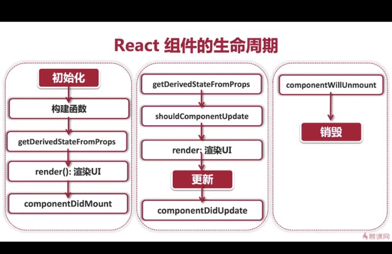

# react-trip

## mooc

https://coding.imooc.com/class/475.html

## 技术栈

react + ts + vite + pnpm

## 学习点

1. tsconfig 的简单讲解
2. react 设计理念
   1. 单向数据流
   2. 虚拟 dom
3. css 模组化（css module）
   1. 使用 \*.d.ts 来定义
   2. jss 模块化引入组件
   3. 使用 typescript-plugin-css-modules 来做 css 模块化的 ts 提示
4. 加载图片和字体
5. React 的事件系统，e.target 描述事件发生的元素 和 e.currentTarget 描述事件绑定的元素
6. React 的 class component 的生命周期，组件由生到死可以分为三个阶段

   1. Mounting: 创建虚拟 DOM，渲染 UI

      这是组件第一次绘制，将会创建虚拟 DOM 元素，渲染 UI，在这里完成了组件的加载和初始化

   2. Updating：更新虚拟 DOM，重新渲染 UI

      组件在运行和交互的阶段，在这个阶段可以处理用户的交互，收集监听事件，更新 DOM 元素，重新渲染 UI

   3. Unmounting：删除虚拟 DOM，移除 UI

      是组件卸载消亡的阶段，在这里，我们会对组件做一些清理工作，删除虚拟 DOM 元素，移除 UI

   4. 具体函数
      

7. setState 是异步还是同步的？
   1. 答案：异步更新，同步执行
   2. setState 本身并非异步，但对 state 的处理机制给人一种异步的假象。state 处理一般发生在生命周期变化的时候
8. 类组件和函数式组件
   1. 类组件由本身携带 state
   2. 函数式组件使用 hook 钩入状态
9. useEffect 的无限循环
   1. 不带第二个参数，当 update 之后执行回调，回调又回 setState，然后触发 update
10. 使用 context 来解决 prop drilling
11. 为什么使用高阶组件
    1. 代替了 mixin 的使用
    2. 抽取重复代码，实现逻辑复用
    3. 条件渲染，控制组件的渲染逻辑（渲染劫持）
    4. 捕获/劫持被处理组件的生命周期
12. 使用了 react-router v5
13. redux
    1. redux 统一保存数据，在隔离数据与 UI 的同时，负责处理数据的绑定
    2. 何时使用
       1. 组件需要共享数据（或者状态 state）的时候
       2. 某个状态在任何地方都可以被随时访问的时候
       3. 某个组件需要改变另一个组件的状态的时候
    3. 使用 react-redux 完成类组件和函数式组件的使用
14. 使用 redux 与 i18n 完成了项目的国际化
15. 使用自定义 hooks - 完成组件与 store 的解耦
16. 使用 redux 代替 mvc 架构
17. 使用 redux-thunk
    1. thunk 可以返回一个函数，而不一定是 js 对象
    2. 在一个 thunk action 中可以完成一些连续的 action 操作
    3. 并且可以处理异步逻辑
    4. 业务逻辑可以从 ui 层面挪到这里，代码分层会更清晰
18. 使用 actionLog 中间件
19. RTK 的使用
20. JWT
    1. 作用：用户授权
       1. 用户授权（Authorization）：当前用户有足够的权限访问特定的资源
       2. 身份认证（Authentication）：使用用户名和密码验证当前用户的身份（就是用户登陆）
    2. 无状态登陆
       1. 有状态登陆：session
    3. JWT只保存在客户端， 支持分布式部署
21. 登陆持久化 - redux-persist
22. 私有路由 - 只有登陆才能看见

## 官方介绍
1. 实现产品浏览，用户登录，购物车，下单结算四大模块，共计实现8个页面，实现13个组件封装
2. 从需求分析开始，逐步实现页面布局，生命周期管理，架构设计，以及全局状态，最终实现项目
3. redux 实现网站状态全局管理
4. react-router 处理公有、私有路由
5. redux-persist 实现网站状态持久化